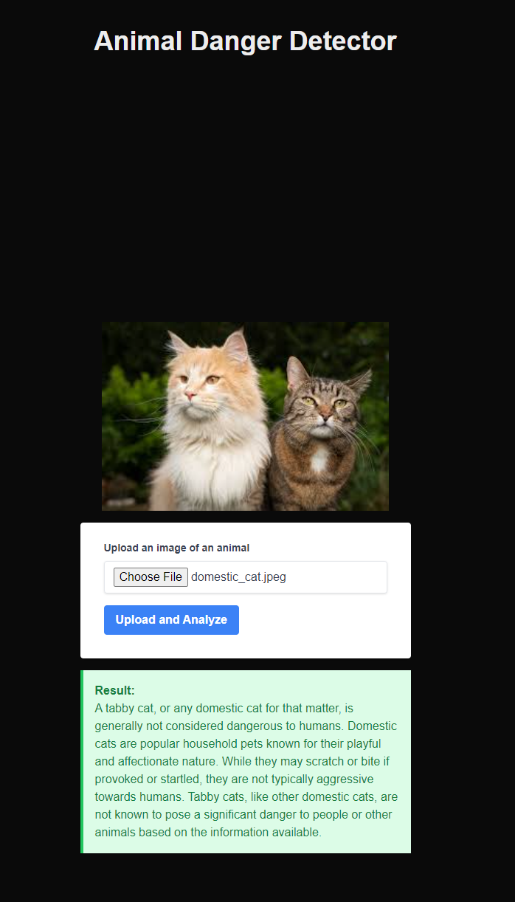

# Animal Danger Detector

This Next.js application allows users to upload images of animals and determines whether the animal is dangerous using computer vision and AI.

## Description



The Animal Danger Detector is a web application that combines the power of computer vision and natural language processing to identify animals in uploaded images and assess their potential danger to humans. This project was created as part of a learning exercise to explore the integration of various AI technologies in a modern web application.

## Features

- Image upload functionality
- Animal classification using a computer vision API
- Danger assessment using OpenAI's GPT model
- Responsive UI built with Next.js and Tailwind CSS

## Technologies Used

- Next.js
- TypeScript
- Tailwind CSS
- Axios for API requests
- OpenAI API
- Computer Vision API (to be specified)

## Setup

1. Clone the repository
2. Install dependencies: `npm install`
3. Set up environment variables in `.env.local`:
   ```
   OPENAI_API_KEY=your_openai_api_key_here
   HUGGINGFACE_API_KEY=your_huggingface_api_key_here
   ```
4. Run the development server: `npm run dev`
5. Open [http://localhost:3000](http://localhost:3000) in your browser

## Usage

1. Upload an image of an animal using the provided form.
2. Click the "Upload and Analyze" button.
3. Wait for the application to process the image and provide results.
4. View the classification result and danger assessment.

## License

This project is open source and available under the [MIT License](LICENSE).